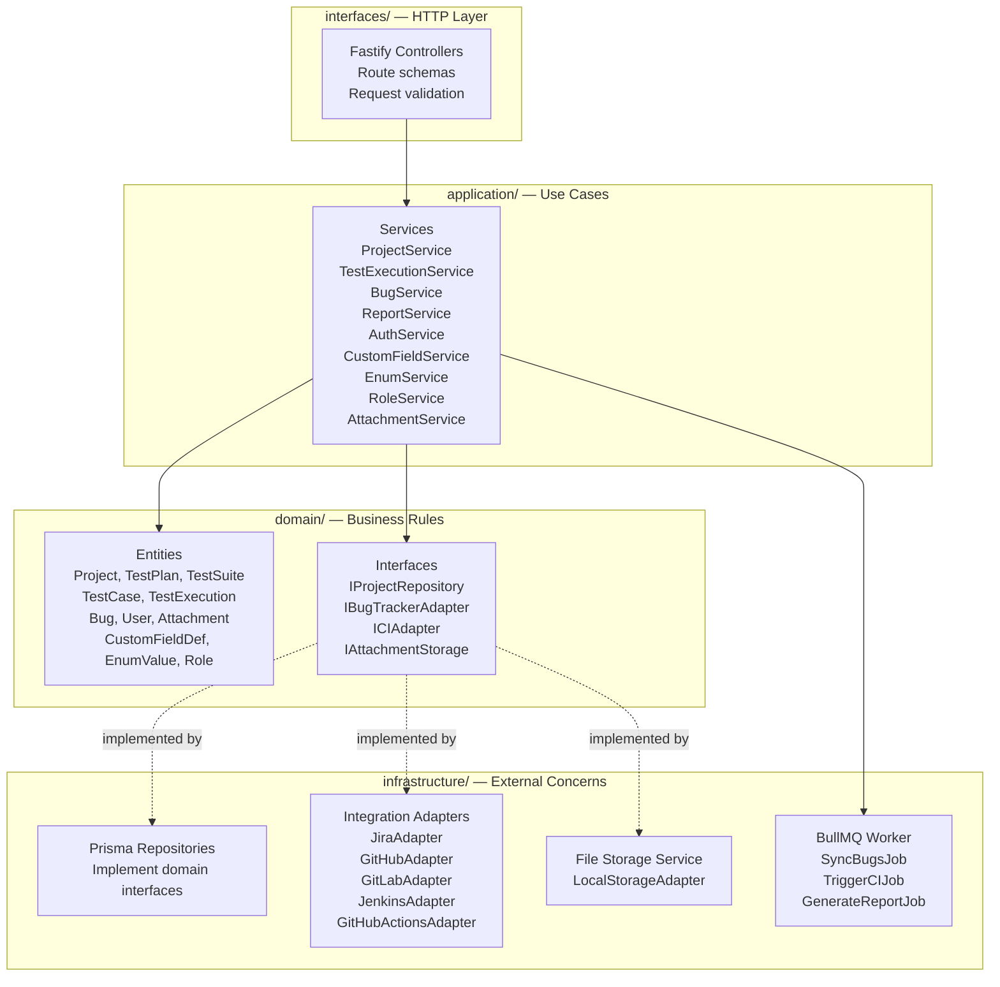
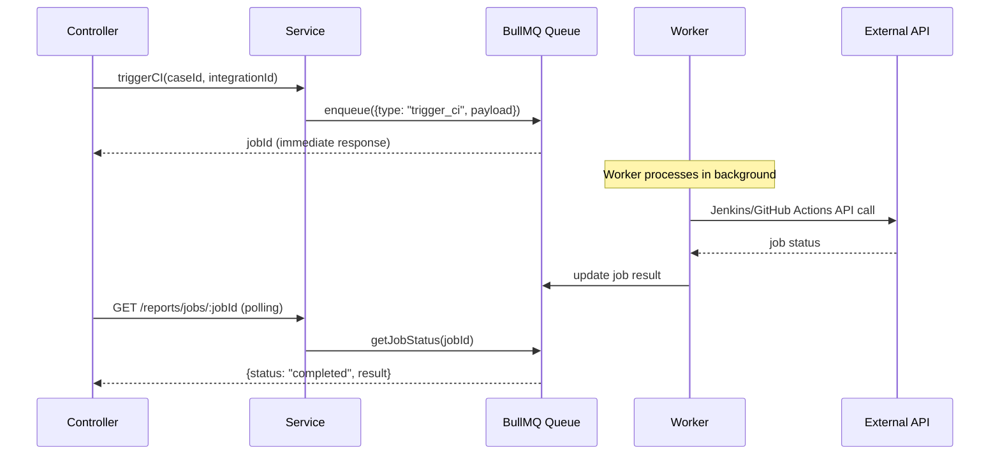
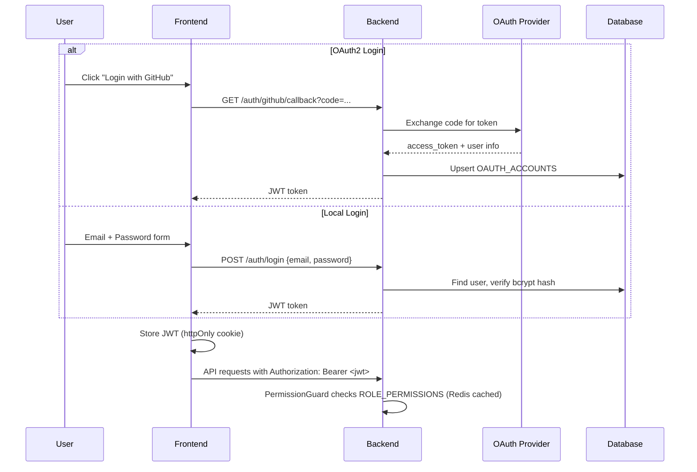

# TestTool — Architecture Diagram

Render this file in VS Code with the "Markdown Preview Mermaid Support" extension, or paste into https://mermaid.live

## System Architecture (C4 — Container Level)

Shown in full-local mode. For cloud deployments, PostgreSQL and backup containers
are replaced by Supabase/Neon/RDS, and storage can point to Supabase Storage or S3.

```mermaid
graph TB
    subgraph Browser["Browser / Client"]
        UI["Next.js 16.2 Frontend\n:3000\nTypeScript + Tailwind CSS\nnext-themes + next-intl + Lucide"]
    end

    subgraph DockerNetwork["Docker Network (full-local profile)"]
        subgraph Public["public network"]
            BE["Backend: Fastify\n:3001\nTypeScript + Prisma\nPassport.js + Winston\nSwagger/OpenAPI"]
        end

        subgraph Internal["internal network"]
            WK["Worker: BullMQ\n(same image as backend)\nProcesses async jobs"]
            PG[("PostgreSQL 16\nLocal DB\n(profile: local-db)")]
            RD[("Redis 7\nCache + Job Queue\nor Upstash/Redis Cloud")]
            BK["Backup Container\npg_dump cron\n(profile: local-db)"]
        end
    end

    subgraph External["External Services"]
        JR["Jira API"]
        GH["GitHub API"]
        GL["GitLab API"]
        JK["Jenkins API"]
        GHA["GitHub Actions API"]
        OAUTH["OAuth2 Providers\n(Google / GitHub / Microsoft)"]
        CLOUDDB[("Cloud DB\nSupabase / Neon / RDS\n(replaces local postgres)")]
        CLOUDSTORAGE["Cloud Storage\nSupabase Storage / S3 / R2\n(replaces local uploads)"]
    end

    subgraph Storage["Host Volumes (local mode only)"]
        UP["/data/uploads\nImages & Videos"]
        BP["/data/backups\nDB Dumps"]
        LG["/logs\nWinston logs"]
    end

    UI -->|"REST API calls\nHTTP/JSON"| BE
    BE -->|"Prisma — direct URL\n(migrations)"| PG
    BE -->|"Prisma — pool URL\n(runtime queries)"| PG
    BE -->|"Cache + enqueue jobs"| RD
    BE -->|"IFileStorageAdapter\n(local / supabase / s3)"| UP
    BE -->|"Write logs"| LG
    WK -->|"Consume jobs"| RD
    WK -->|"DB operations"| PG
    WK -->|"Bug sync"| JR
    WK -->|"Bug sync"| GH
    WK -->|"Bug sync"| GL
    WK -->|"Trigger CI"| JK
    WK -->|"Trigger CI"| GHA
    BE -->|"OAuth2 callbacks"| OAUTH
    BK -->|"Daily dump"| BP
    BK -->|"Read DB"| PG

    BE -.->|"cloud mode"| CLOUDDB
    BE -.->|"cloud mode"| CLOUDSTORAGE
```

## Clean Architecture Layer Diagram

## Worker Queue Job Flow

## Authentication Flow

