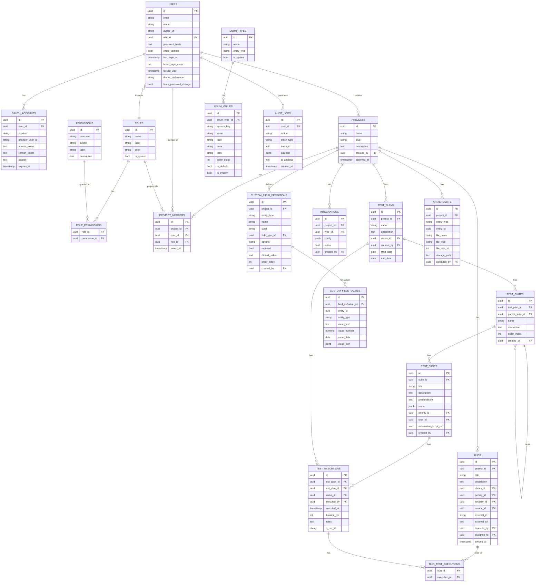

# TestTool — Entity-Relationship Diagram

Render this file in VS Code with the "Markdown Preview Mermaid Support" extension, or paste into https://mermaid.live

```mermaid
erDiagram
    USERS {
        uuid id PK
        string email
        string name
        string avatar_url
        uuid role_id FK
        text password_hash
        bool email_verified
        timestamp last_login_at
        int failed_login_count
        timestamp locked_until
        string theme_preference
        bool force_password_change
    }

    OAUTH_ACCOUNTS {
        uuid id PK
        uuid user_id FK
        string provider
        string provider_user_id
        text access_token
        text refresh_token
        text scopes
        timestamp expires_at
    }

    ROLES {
        uuid id PK
        string name
        string label
        string color
        bool is_system
    }

    PERMISSIONS {
        uuid id PK
        string resource
        string action
        string label
        text description
    }

    ROLE_PERMISSIONS {
        uuid role_id FK
        uuid permission_id FK
    }

    PROJECTS {
        uuid id PK
        string name
        string slug
        text description
        uuid created_by FK
        timestamp archived_at
    }

    PROJECT_MEMBERS {
        uuid id PK
        uuid project_id FK
        uuid user_id FK
        uuid role_id FK
        timestamp joined_at
    }

    TEST_PLANS {
        uuid id PK
        uuid project_id FK
        string name
        text description
        uuid status_id FK
        uuid created_by FK
        date start_date
        date end_date
    }

    TEST_SUITES {
        uuid id PK
        uuid test_plan_id FK
        uuid parent_suite_id FK
        string name
        text description
        int order_index
        uuid created_by FK
    }

    TEST_CASES {
        uuid id PK
        uuid suite_id FK
        string title
        text description
        text preconditions
        jsonb steps
        uuid priority_id FK
        uuid type_id FK
        text automation_script_ref
        uuid created_by FK
    }

    TEST_EXECUTIONS {
        uuid id PK
        uuid test_case_id FK
        uuid test_plan_id FK
        uuid status_id FK
        uuid executed_by FK
        timestamp executed_at
        int duration_ms
        text notes
        string ci_run_id
    }

    BUGS {
        uuid id PK
        uuid project_id FK
        string title
        text description
        uuid status_id FK
        uuid priority_id FK
        uuid severity_id FK
        uuid source_id FK
        string external_id
        text external_url
        uuid reported_by FK
        uuid assigned_to FK
        timestamp synced_at
    }

    BUG_TEST_EXECUTIONS {
        uuid bug_id FK
        uuid execution_id FK
    }

    INTEGRATIONS {
        uuid id PK
        uuid project_id FK
        uuid type_id FK
        jsonb config
        bool active
        uuid created_by FK
    }

    CUSTOM_FIELD_DEFINITIONS {
        uuid id PK
        uuid project_id FK
        string entity_type
        string name
        string label
        uuid field_type_id FK
        jsonb options
        bool required
        text default_value
        int order_index
        uuid created_by FK
    }

    CUSTOM_FIELD_VALUES {
        uuid id PK
        uuid field_definition_id FK
        uuid entity_id
        string entity_type
        text value_text
        numeric value_number
        date value_date
        jsonb value_json
    }

    ATTACHMENTS {
        uuid id PK
        uuid project_id FK
        string entity_type
        uuid entity_id
        string file_name
        string file_type
        int file_size_kb
        text storage_path
        uuid uploaded_by FK
    }

    ENUM_TYPES {
        uuid id PK
        string name
        string entity_type
        bool is_system
    }

    ENUM_VALUES {
        uuid id PK
        uuid enum_type_id FK
        string system_key
        string value
        string label
        string color
        string icon
        int order_index
        bool is_default
        bool is_system
    }

    AUDIT_LOGS {
        uuid id PK
        uuid user_id FK
        string action
        string entity_type
        uuid entity_id
        jsonb payload
        inet ip_address
        timestamp created_at
    }

    %% Relationships
    USERS ||--o{ OAUTH_ACCOUNTS : "has"
    USERS }o--|| ROLES : "has role"
    ROLES ||--o{ ROLE_PERMISSIONS : "has"
    PERMISSIONS ||--o{ ROLE_PERMISSIONS : "granted to"
    USERS ||--o{ PROJECTS : "creates"
    PROJECTS ||--o{ PROJECT_MEMBERS : "has"
    USERS ||--o{ PROJECT_MEMBERS : "member of"
    ROLES ||--o{ PROJECT_MEMBERS : "project role"
    PROJECTS ||--o{ TEST_PLANS : "has"
    TEST_PLANS ||--o{ TEST_SUITES : "has"
    TEST_SUITES ||--o{ TEST_SUITES : "nests"
    TEST_SUITES ||--o{ TEST_CASES : "has"
    TEST_CASES ||--o{ TEST_EXECUTIONS : "has"
    TEST_PLANS ||--o{ TEST_EXECUTIONS : "has"
    PROJECTS ||--o{ BUGS : "has"
    BUGS ||--o{ BUG_TEST_EXECUTIONS : "linked to"
    TEST_EXECUTIONS ||--o{ BUG_TEST_EXECUTIONS : "has"
    PROJECTS ||--o{ INTEGRATIONS : "has"
    PROJECTS ||--o{ CUSTOM_FIELD_DEFINITIONS : "defines"
    CUSTOM_FIELD_DEFINITIONS ||--o{ CUSTOM_FIELD_VALUES : "has values"
    PROJECTS ||--o{ ATTACHMENTS : "has"
    ENUM_TYPES ||--o{ ENUM_VALUES : "has"
    USERS ||--o{ AUDIT_LOGS : "generates"
```
